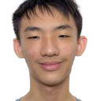
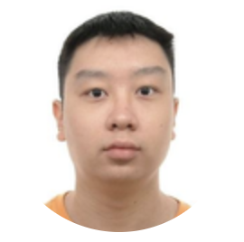

# About Us

We are a team based in the [School of Computing, National University of Singapore](http://www.comp.nus.edu.sg).

You can reach us at the email `seer[at]comp.nus.edu.sg`

## Project team

### Max Tan Kia Lok

[[github](https://github.com/Kia-Lok)]

* Role: Developer
* Responsibilities: To be confirmed

### Jane Doe

[[github](http://github.com/johndoe)]
[[portfolio](team/johndoe.md)]

* Role: Team Lead
* Responsibilities: UI

### SG Tan

[[github](http://github.com/strixgoldhorn)]
[[portfolio](team/sg.md)]

* Role: SWE
* Responsibilities: TBC

### Tan Yu Bin

[[github](http://github.com/origami10004)]
[[portfolio](team/origami10004.md)]

* Role: Developer
* Responsibilities: TBC

### James Doe

[[github](http://github.com/johndoe)]
[[portfolio](team/johndoe.md)]

* Role: Developer
* Responsibilities: UI

### Zee Ming Zan

[[github](http://github.com/mingzanzee)]
[[portfolio](team/mingzan.md)]

* Role: Developer
* Responsibilities: Code Quality and Testing. In charge of ???
