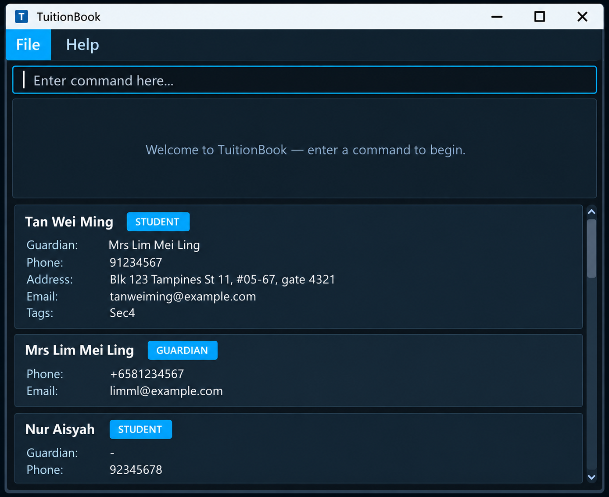

# TuitionBook User Guide

TuitionBook is a **desktop application for managing tutoring contacts, optimized for use through a Command Line Interface (CLI)** while retaining the benefits of a Graphical User Interface (GUI). If you type quickly, TuitionBook can help you manage students and guardians faster than traditional GUI applications.

<!-- * Table of Contents -->
<page-nav-print />

--------------------------------------------------------------------------------------------------------------------

## Quick start

1. Ensure that Java `25` or later is installed on your computer. 
   **Mac users:** Ensure you have the precise JDK version prescribed [here](https://se-education.org/guides/tutorials/javaInstallationMac.html).

1. Download the latest `.jar` file from the project's [GitHub Releases](https://github.com/AY2627S1-CS2103T-T16-2/tp/releases) page.

1. Copy the file to the folder you want to use as the _home folder_ for your TuitionBook.

1. Open a terminal, `cd` to the folder containing the JAR file, and run `java -jar tuitionbook.jar`. 
   A GUI similar to the one below should appear in a few seconds. On first launch, the contact list is empty. 
   

1. Type a command in the command box and press Enter to execute it. For example, type **`help`** and press Enter to open the help window. 
   Some example commands you can try:

   * `list` : Lists all contacts.

   * `add r/student n/John Doe p/98765432 e/johnd@example.com a/John street, block 123, #01-01` : Adds a student contact named `John Doe` to TuitionBook.

   * `delete 3` : Deletes the 3rd contact shown in the current list.

   * `clear` : Deletes all contacts.

   * `exit` : Exits the app.

1. Refer to the [Features](#features) section below for details of each command.

--------------------------------------------------------------------------------------------------------------------

## Features

<box type="info" seamless>

**Notes about the command format:** 

* Words in `UPPER_CASE` are the parameters to be supplied by the user. 
  For example, in `add n/NAME`, replace `NAME` with a value such as `John Doe`.

* Items in square brackets are optional. 
  For example, `n/NAME [t/TAG]` can be used as `n/John Doe t/friend` or as `n/John Doe`.

* Items followed by `...` can appear zero or more times. 
  For example, `[t/TAG]... ` may be omitted, or written as `t/friend` or `t/friend t/family`.

* Parameters can be in any order. 
  For example, if the command specifies `n/NAME p/PHONE_NUMBER`, `p/PHONE_NUMBER n/NAME` is also acceptable.

* Extraneous parameters for commands that take no parameters, such as `help`, `exit`, and `clear`, are ignored. 
  For example, `help 123` is interpreted as `help`.

* If you are using a PDF version of this document, be careful when copying and pasting commands that span multiple lines as space characters surrounding line-breaks may be omitted when copied over to the application.
</box>

### Viewing help: `help`

Shows a message with a link to this User Guide, where every command is explained. Use the `Copy URL` button to copy the link, then open it in your browser.

Format: `help`

* You can also open the help window by pressing <kbd>F1</kbd> or via the `Help` menu.
* An internet connection is needed to open the linked page itself.

### Adding a contact: `add`

Adds a student or guardian contact to TuitionBook.

Format: `add r/ROLE n/NAME p/PHONE [e/EMAIL] [a/ADDRESS] [t/TAG]...`

* `ROLE`, `NAME`, and `PHONE` are mandatory.
* `ROLE` must be either `student` or `guardian`, case-insensitively.
* `NAME` must start with a Unicode letter or number. It may contain Unicode letters and numbers, Unicode combining
  marks, spaces, periods (`.`), straight apostrophes (`'`), and hyphens (`-`). Surrounding whitespace is ignored,
  while the accepted name's capitalization, punctuation, and Unicode representation are preserved.
* `PHONE` must contain at least three digits. It may start with `+`, and a single space or hyphen may appear between
  digits. These formatting characters are preserved.
* `EMAIL` and `ADDRESS` are optional.
* `g/` is not accepted by `add`; linking a guardian to a student is a separate operation.

<box type="tip" seamless>

**Tip:** A person can have any number of tags, including zero.

TuitionBook treats two contacts as duplicates only when both their normalized names and normalized phone numbers match.
Name comparison is case-insensitive, ignores surrounding and repeated spaces, and treats precomposed and decomposed
Unicode forms as equivalent. Phone comparison removes spaces and hyphens while retaining a leading `+`. Country-code
equivalence is not applied, so phone numbers that differ by a leading `+` are distinct.

A young student without their own phone number may reuse their guardian's phone number. If an email is supplied, the
guardian's email may also be reused. The student and guardian remain distinct contacts because their names differ.
</box>

Examples:
* `add r/student n/John Doe p/98765432 e/johnd@example.com a/John street, block 123, #01-01`
* `add r/guardian n/Betsy Crowe p/1234567 t/family`

### Listing contacts: `list`

Shows all contacts, or only contacts with a specified role. `list` clears any active name or role filter.

Format: `list [r/ROLE]`

* `ROLE` is `student` or `guardian`, case-insensitively.
* `list r/student` shows only students; `list r/guardian` shows only guardians.
* Other trailing text is rejected.
* Before linking a student to a guardian after role filtering, enter `list` to restore the full list so that both
  contacts can be selected.
* Each contact card displays a `STUDENT` or `GUARDIAN` role badge.
* Each contact card labels its phone number, email address, and home address with `Phone:`, `Email:`, and `Address:`.
* Student cards display a `Guardian:` line with the linked guardian's name, or `-` when no guardian is linked.
  Guardian cards do not display this line.
* Missing email addresses and home addresses display as `Email: -` and `Address: -`.

### Viewing a contact: `view`

Replaces the contact list with a contact's details and their recorded relationship. The next command other than
`view` restores the contact list.

Format: `view INDEX`

* `INDEX` is the positive index shown in the current contact list. After `find` or `list r/ROLE`, it refers to the
  filtered list.
* For a student, the result includes the linked guardian's name, role, phone, email, address, and tags. If the student
  has no guardian link, it shows `No guardian linked.`
* For a guardian, the result lists the names of linked students in contact-list order. If there are none, it shows
  `No students linked.` Related contacts are shown even when the current filter hides them.
* Missing optional email, address, or tags are shown as `-`. Tags appear in alphabetical order. `view` does not change
  contact data or the active filter.

Examples using the initial sample contacts:

* `view 1` replaces the contact list with Alex Yeoh's details and the details of his linked guardian, Bernice Yu.
* `view 2` replaces the contact list with Bernice Yu's details and lists Alex Yeoh as a linked student.
* `list r/student` followed by `view 1` still shows Bernice Yu's details, although guardians are hidden from the list.

### Editing a person: `edit`

Edits an existing person in TuitionBook.

Format: `edit INDEX [n/NAME] [p/PHONE] [e/EMAIL] [a/ADDRESS] [t/TAG]... `

* Edits the person at the specified `INDEX`. The index refers to the index number shown in the displayed person list. The index **must be a positive integer** 1, 2, 3, ...
* At least one of the optional fields must be provided.
* Existing values will be updated to the input values.
* `NAME` must start with a Unicode letter or number. It may contain Unicode letters and numbers, Unicode combining
  marks, spaces, periods (`.`), straight apostrophes (`'`), and hyphens (`-`). Surrounding whitespace is ignored,
  while the accepted name's capitalization, punctuation, and Unicode representation are preserved.
* `PHONE` must contain at least three digits. It may start with `+`, and a single space or hyphen may appear between
  digits. These formatting characters are preserved.
* When editing tags, all of the person's existing tags are removed; adding tags is not cumulative.
* To remove all of a person's tags, enter `t/` without a tag after it.

Examples:
*  `edit 1 p/91234567 e/johndoe@example.com` Edits the phone number and email address of the 1st person to be `91234567` and `johndoe@example.com` respectively.
*  `edit 2 n/Betsy Crower t/` Edits the name of the 2nd person to be `Betsy Crower` and clears all existing tags.

### Linking a student to a guardian: `link`

Links a student contact to a guardian contact.

Format: `link STUDENT_INDEX GUARDIAN_INDEX`

* The first index must refer to a student and the second index must refer to a guardian. Both indexes refer to the
  currently displayed contact list.
* If the student already has a different guardian, the previous guardian is unlinked and the result identifies that
  previous guardian.
* Linking a student to the guardian they are already linked to is idempotent; TuitionBook reports that the link already
  exists and makes no change.

Example: `link 1 2` links the student at index 1 to the guardian at index 2.

### Locating persons by name: `find`

Finds persons whose names contain any of the given keywords.

Format: `find KEYWORD [MORE_KEYWORDS]`

* The search is case-insensitive; for example, `hans` matches `Hans`.
* Keyword order does not matter; for example, `Hans Bo` matches `Bo Hans`.
* The search considers only names.
* Only full words match; for example, `Han` does not match `Hans`.
* Persons matching at least one keyword are returned (an `OR` search); for example, `Hans Bo` returns `Hans Gruber` and `Bo Yang`.

Examples:
* `find John` returns `john` and `John Doe`
* `find alex david` returns `Alex Yeoh`, `David Li` 
  

### Deleting a person: `delete`

Deletes the specified person from TuitionBook.

Format: `delete INDEX`

* Deletes the person at the specified `INDEX`.
* The index refers to the index number shown in the displayed person list.
* The index **must be a positive integer** 1, 2, 3, ...
* Deleting a guardian keeps their linked students, but clears those students' guardian links.

Examples:
* `list` followed by `delete 2` deletes the 2nd person in TuitionBook.
* `find Betsy` followed by `delete 1` deletes the 1st person in the results of the `find` command.

### Clearing all entries: `clear`

Clears all entries from TuitionBook.

Format: `clear`

### Exiting the program: `exit`

Exits the program. All data is already saved, so it is always safe to exit.

Format: `exit`

### Saving the data

TuitionBook automatically saves data after every command. You do not need to save manually.

### Editing the data file

TuitionBook data is saved automatically as a JSON file `[JAR file location]/data/addressbook.json`. Advanced users are welcome to update data directly by editing that data file.

Each contact in the file has these relationship fields:

* `id`: the contact's unique identifier. It must be a valid UUID and must not be repeated in the file.
* `role`: either `STUDENT` or `GUARDIAN`.
* `guardianId`: optional. For a student, it is the `id` of a guardian contact; guardians must have no guardian link
  (the field is absent or `null`).

Do not change an existing `id` when editing the file. A current-format contact must include valid `id` and `role` fields.
Contacts with the same normalized name and phone number are duplicates and make the file invalid, even when their `id`
values differ.

Data files created before these relationship fields were introduced remain supported. A contact that has none of `id`,
`role`, or `guardianId` is loaded as an unlinked student and receives a generated `id`. The updated fields are written
when TuitionBook next saves the data file.

If a `guardianId` is malformed, refers to a missing contact, refers to a student, or links a student to itself,
TuitionBook keeps the contact but removes that guardian link when loading the file.

<box type="warning" seamless>

**Caution:**
If your changes make the data file invalid, TuitionBook starts with an empty contact list at the next run. It leaves the invalid file unchanged and blocks saves to avoid overwriting it. Back up and correct or remove the file before restarting TuitionBook. Still, we recommend backing up the file before editing it. 
Furthermore, certain edits can cause TuitionBook to behave in unexpected ways (e.g., if a value entered is outside of the acceptable range). Therefore, edit the data file only if you are confident that you can update it correctly.
</box>

### Archiving data files `[coming in v2.0]`

_Details coming soon ..._

--------------------------------------------------------------------------------------------------------------------

## FAQ

**Q**: How do I transfer my data to another computer? 
**A**: Install the app on the other computer and overwrite the data file it creates with the data file from your previous TuitionBook home folder.

--------------------------------------------------------------------------------------------------------------------

## Known issues

1. **When using multiple screens**, if you move the application to a secondary screen, and later switch to using only the primary screen, the GUI will open off-screen. The remedy is to delete the `preferences.json` file created by the application before running the application again.
2. **If you minimize the Help Window** and then run the `help` command (or use the `Help` menu, or the keyboard shortcut `F1`) again, the original Help Window will remain minimized, and no new Help Window will appear. The remedy is to manually restore the minimized Help Window.

--------------------------------------------------------------------------------------------------------------------

## Command summary

Action     | Format, Examples
-----------|----------------------------------------------------------------------------------------------------------------------------------------------------------------------
**Add**    | `add r/ROLE n/NAME p/PHONE [e/EMAIL] [a/ADDRESS] [t/TAG]...`   e.g., `add r/student n/James Ho p/22224444 e/jamesho@example.com a/123, Clementi Rd, 1234665 t/friend t/colleague`
**Clear**  | `clear`
**Delete** | `delete INDEX`  e.g., `delete 3`
**Edit**   | `edit INDEX [n/NAME] [p/PHONE_NUMBER] [e/EMAIL] [a/ADDRESS] [t/TAG]... `  e.g.,`edit 2 n/James Lee e/jameslee@example.com`
**Link**   | `link STUDENT_INDEX GUARDIAN_INDEX`   e.g., `link 1 2`
**Find**   | `find KEYWORD [MORE_KEYWORDS]`  e.g., `find James Jake`
**List**   | `list [r/ROLE]`  e.g., `list r/student`
**View**   | `view INDEX`  e.g., `view 1`
**Help**   | `help`
